### Termos e acordos

Ao iniciar este projeto, você concorda com as diretrizes do Código de Ética e Conduta e do Manual da Pessoa Estudante da Trybe

# Boas vindas ao repositório do projeto Cookmaster!

Você já usa o GitHub diariamente para desenvolver os exercícios, certo? Agora, para desenvolver os projetos, você deverá seguir as instruções a seguir. Fique atento a cada passo, e se tiver qualquer dúvida, nos envie por Slack! #vqv 🚀

Aqui você vai encontrar os detalhes de como estruturar o desenvolvimento do seu projeto a partir deste repositório, utilizando uma branch específica e um Pull Request para colocar seus códigos.

---

# Sumário

- [Boas vindas ao repositório do projeto Cookmaster!](#boas-vindas-ao-repositório-do-projeto-cookmaster)
- [Habilidades](#habilidades)
- [Entregáveis](#entregáveis)
  - [O que deverá ser desenvolvido](#o-que-deverá-ser-desenvolvido)
  - [Desenvolvimento](#desenvolvimento)
  - [Data de Entrega](#data-de-entrega)
- [Instruções para entregar seu projeto](#instruções-para-entregar-seu-projeto)
  - [Antes de começar a desenvolver](#antes-de-começar-a-desenvolver)
  - [Durante o desenvolvimento](#durante-o-desenvolvimento)
- [Como desenvolver](#como-desenvolver)
  - [Todos os seus endpoints devem estar no padrão REST](#todos-os-seus-endpoints-devem-estar-no-padrão-rest)
  - [Conexão com o Banco](#conexão-com-o-banco)
  - [Coleções](#coleções)
  - [Linter](#linter)
  - [Testes](#testes)
    - [Dica: desativando testes](#dica-desativando-testes)
- [Requisitos do projeto](#requisitos-do-projeto)
  - [Requisitos Obrigatórios](#requisitos-obrigatórios)
    - [1 - Crie um endpoint para o cadastro de usuários](#1---crie-um-endpoint-para-o-cadastro-de-usuários)
    - [2 - Crie um endpoint para o login de usuários](#2---crie-um-endpoint-para-o-login-de-usuários)
    - [3 - Crie um endpoint para o cadastro de receitas](#3---crie-um-endpoint-para-o-cadastro-de-receitas)
    - [4 - Crie um endpoint para a listagem de receitas](#4---crie-um-endpoint-para-a-listagem-de-receitas)
    - [5 - Crie um endpoint para visualizar uma receita específica](#5---crie-um-endpoint-para-visualizar-uma-receita-específica)
    - [6 - Crie uma query em mongo que insira uma pessoa usuária com permissões de admin](#6---crie-uma-query-em-mongo-que-insira-uma-pessoa-usuária-com-permissões-de-admin)
    - [7 - Crie um endpoint para a edição de uma receita](#7---crie-um-endpoint-para-a-edição-de-uma-receita)
    - [8 - Crie um endpoint para a exclusão de uma receita](#8---crie-um-endpoint-para-a-exclusão-de-uma-receita)
    - [9 - Crie um endpoint para a adição de uma imagem a uma receita](#9---crie-um-endpoint-para-a-adição-de-uma-imagem-a-uma-receita)
    - [10 - Crie um endpoint para acessar a imagem de uma receita](#10---crie-um-endpoint-para-acessar-a-imagem-de-uma-receita)
    - [11 - Crie testes de integração que cubram no mínimo 30% dos arquivos em `src`, com um mínimo de 50 linhas cobertas](#11---crie-testes-de-integração-que-cubram-no-mínimo-30-dos-arquivos-em-src-com-um-mínimo-de-50-linhas-cobertas)
  - [Requisitos Bônus](#requisitos-bônus)
    - [12 - Crie um endpoint para cadastro de pessoas administradoras](#12---crie-um-endpoint-para-cadastro-de-pessoas-administradoras)
    - [13 - Crie testes de integração que cubram no mínimo 60% dos arquivos em `src`, com um mínimo de 100 linhas cobertas](#13---crie-testes-de-integração-que-cubram-no-mínimo-60-dos-arquivos-em-src-com-um-mínimo-de-100-linhas-cobertas)
    - [14 - Crie testes de integração que cubram no mínimo 90% dos arquivos em `src`, com um mínimo de 150 linhas cobertas](#14---crie-testes-de-integração-que-cubram-no-mínimo-90-dos-arquivos-em-src-com-um-mínimo-de-150-linhas-cobertas)
  - [Depois de terminar o desenvolvimento (opcional)](#depois-de-terminar-o-desenvolvimento-opcional)
- [Revisando um pull request](#revisando-um-pull-request)
- [Avisos finais](#avisos-finais)

---

# Habilidades

Neste projeto, você será capaz de:

- Entender o que há por dentro de um token de autenticação;

- Gerar tokens a partir de informações como login e senha;

- Autenticar rotas do Express, usando o token JWT;

- Fazer upload de arquivos em APIs REST;

- Salvar arquivos no servidor através de uma API REST;

- Consultar arquivos do servidor através de uma api REST.

- Realizar testes de integração

---

# Entregáveis

Para entregar o seu projeto você deverá criar um Pull Request neste repositório.

Lembre-se que você pode consultar nosso conteúdo sobre [Git & GitHub](https://app.betrybe.com/course/fundamentals/git) sempre que precisar!

---

## O que deverá ser desenvolvido

Você vai desenvolver seu app utilizando a arquitetura MSC!

Neste novo projeto deverá ser possível fazer o cadastro e login de pessoas usuárias, onde apenas essas pessoas poderão acessar, modificar e deletar as receitas que cadastrou.

---

## Desenvolvimento

Você vai desenvolver todas as camadas da aplicação (Models, Service e Controllers) a partir do seu código no projeto cookmaster.

Através dessa aplicação, será possível realizar as operações básicas que se pode fazer em um determinado banco de dados: Criação, Leitura, Atualização e Exclusão (ou `CRUD`, para as pessoas mais íntimas 😜).

Para realizar qualquer tipo de alteração no banco de dados (como cadastro, edição ou exclusão de receitas) será necessário autenticar-se. Além disso, as pessoas usuárias devem poder ser clientes ou administradores. Pessoas clientes apenas poderão disparar ações nas receitas que ele mesmo criou. Já uma pessoa administradora pode disparar qualquer ação em qualquer receita.

A autenticação deverá ser feita via `JWT`.

O código para cadastro de pessoas usuárias deve ser criado por você utilizando os conhecimentos adquiridos nesse bloco.

Deverá ser possível adicionar uma imagem à uma receita, utilizando o upload de arquivos fornecido pelo `multer`.

⚠️ **Dicas Importantes** ⚠️:

- Não haverá front-end neste projeto, portanto não se preocupe com a visualização, mas apenas com as funcionalidades e organização do código.

- Sua API deve ser desenvolvida dentro da pasta `./src`, seus testes de integração, na pasta `./src/integration-tests`;

- Para permitir que as imagens sejam acessadas através da API, você deve utilizar o middleware `static` do express, da seguinte forma:

  ```js
  // ./src/api/app.js

  const path = require('path');
  // ...

  // /images é o caminho/end-point da API onde as imagens estarão disponíveis
  // path.join(__dirname, '..', 'uploads') é o caminho da pasta onde o multer deve salvar suas imagens ao realizar o upload
  // a pasta `uploads` está em `./src/uploads` e não deve ser renomeada ou removida (assim como o arquivo `ratinho.jpg`)
  app.use('/images', express.static(path.join(__dirname, '..', 'uploads')));

  // ...
  ```

---

## Data de Entrega

    - Serão `3` dias de projeto.
    - Data de entrega para avaliação final do projeto: `15/11/2021 - 14:00h`.

---

# Instruções para entregar seu projeto

## Antes de começar a desenvolver

1. Clone o repositório

- `git clone https://github.com/tryber/sd-011-cookmaster.git`.
- Entre na pasta do repositório que você acabou de clonar:
  - `cd sd-011-cookmaster`

2. Instale as dependências [**Caso existam**]

- `npm install`

3. Crie uma branch a partir da branch `master`

- Verifique que você está na branch `master`
  - Exemplo: `git branch`
- Se não estiver, mude para a branch `master`
  - Exemplo: `git checkout master`
- Agora crie uma branch à qual você vai submeter os `commits` do seu projeto
  - Você deve criar uma branch no seguinte formato: `nome-de-usuario-nome-do-projeto`
  - Exemplo: `git checkout -b joaozinho-sd-011-cookmaster`

4. Adicione as mudanças ao _stage_ do Git e faça um `commit`

- Verifique que as mudanças ainda não estão no _stage_
  - Exemplo: `git status` (deve aparecer listada a pasta _joaozinho_ em vermelho)
- Adicione o novo arquivo ao _stage_ do Git
    - Exemplo:
      - `git add .` (adicionando todas as mudanças - _que estavam em vermelho_ - ao stage do Git)
      - `git status` (deve aparecer listado o arquivo _joaozinho/README.md_ em verde)
- Faça o `commit` inicial
    - Exemplo:
      - `git commit -m 'iniciando o projeto x'` (fazendo o primeiro commit)
      - `git status` (deve aparecer uma mensagem tipo _nothing to commit_ )

5. Adicione a sua branch com o novo `commit` ao repositório remoto

- Usando o exemplo anterior: `git push -u origin joaozinho-sd-0x-cookmaster`

6. Crie um novo `Pull Request` _(PR)_

- Vá até a página de _Pull Requests_ do [repositório no GitHub](https://github.com/tryber/sd-011-cookmaster/pulls)
- Clique no botão verde _"New pull request"_
- Clique na caixa de seleção _"Compare"_ e escolha a sua branch **com atenção**
- Clique no botão verde _"Create pull request"_
- Adicione uma descrição para o _Pull Request_ e clique no botão verde _"Create pull request"_
- **Não se preocupe em preencher mais nada por enquanto!**
- Volte até a [página de _Pull Requests_ do repositório](https://github.com/tryber/sd-011-cookmaster/pulls) e confira que o seu _Pull Request_ está criado

---

## Durante o desenvolvimento

- Faça `commits` das alterações que você fizer no código regularmente.

- Lembre-se de sempre após um (ou alguns) `commits` atualizar o repositório remoto.

- Os comandos que você utilizará com mais frequência são:
  1. `git status` _(para verificar o que está em vermelho - fora do stage - e o que está em verde - no stage)_
  2. `git add` _(para adicionar arquivos ao stage do Git)_
  3. `git commit` _(para criar um commit com os arquivos que estão no stage do Git)_
  4. `git push -u nome-da-branch` _(para enviar o commit para o repositório remoto na primeira vez que fizer o `push` de uma nova branch)_
  5. `git push` _(para enviar o commit para o repositório remoto após o passo anterior)_

---

# Como desenvolver

**⚠️ Leia-os atentamente e siga à risca o que for pedido. ⚠️**

**👀 Observações importantes:**

 - O não cumprimento de um requisito, total ou parcialmente, impactará em sua avaliação;
 - O projeto deve rodar na porta **3000**;
 - A testagem local depende da API estar rodando (utilize `npm run dev` para facilitar o processo);

##  Todos os seus endpoints devem estar no padrão REST

- Use os verbos HTTP adequados para cada operação.

- Agrupe e padronize suas URL em cada recurso.

- Garanta que seus endpoints sempre retornem uma resposta, havendo sucesso nas operações ou não.

- Retorne os códigos de status corretos (recurso criado, erro de validação, autorização, etc).

---

Há dois arquivos em `./src/api/` no repositório: `server.js` e `app.js`, **ambos não devem ser renomeados ou apagados**. 

Em `app.js` o seguinte trecho de código não deve ser removido:

```javascript
app.get('/', (request, response) => {
  response.send();
});
```
Isso está configurado para o avaliador funcionar corretamente.

## Conexão com o Banco

**⚠️ IMPORTANTE! ⚠️**

O avaliador não consegue ler as informações que estão no local (localhost).
Portanto, para realizar a conexão com o banco, utilize os seguintes parâmetros:

```javascript
require('dotenv').config();
const MONGO_DB_URL = `mongodb://${process.env.HOST || 'mongodb'}:27017/Cookmaster`;
const DB_NAME = 'Cookmaster';
```
Além disso, **renomeie o arquivo `.env.dev` para `.env`**.

Com essas configurações, enquanto estiver na máquina local, o banco será executado normalmente via localhost (possibilitando os testes via `npm test`).
Como o arquivo `.env` não será enviado para o GitHub (não se preocupe com isso, pois já está configurado no `.gitignore`), o avaliador não executará o banco via localhost e realizará a avaliação corretamente.

## Coleções

O banco terá duas coleções: usuários e receitas.

A coleção de usuários deverá ter o seguinte nome: `users`.

Os campos da coleção `users` terão este formato:

```json
{ "name" : "Erick Jacquin", "email" : "erickjacquin@gmail.com", "password" : "12345678", "role" : "user" }
```

A resposta do insert para ser retornada após a criação é esta:

```json
{ "_id" : ObjectId("5f46914677df66035f61a355"), "name" : "Erick Jacquin", "email" : "erickjacquin@gmail.com", "password" : "12345678", "role" : "user" }
```
(O _id será gerado automaticamente pelo mongodb)

A coleção de receitas deverá ter o seguinte nome: `recipes`.

Os campos da coleção `recipes` terão este formato:

```json
{ "name" : "Receita do Jacquin", "ingredients" : "Frango", "preparation" : "10 minutos no forno" }
```

A resposta do insert para ser retornada após a criação é esta:

```json
{ "_id" : ObjectId("5f46919477df66035f61a356"), "name" : "string", "ingredients" : "string", "preparation" : "string", "userId" : ObjectId("5f46914677df66035f61a355") }
```
(O _id será gerado automaticamente pelo mongodb, e o userId será gerado com o id do usuário que criou a receita)

---

## Linter

Usaremos o [ESLint](https://eslint.org/) para fazer a análise estática do seu código.

Este projeto já vem com as dependências relacionadas ao _linter_ configuradas no arquivos `package.json`.

Para poder rodar os `ESLint` em um projeto basta executar o comando `npm install` dentro do projeto e depois `npm run lint`. Se a análise do `ESLint` encontrar problemas no seu código, tais problemas serão mostrados no seu terminal. Se não houver problema no seu código, nada será impresso no seu terminal.

⚠ PULL REQUESTS COM ISSUES DE LINTER NÃO SERÃO AVALIADAS. ATENTE-SE PARA RESOLVÊ-LAS ANTES DE FINALIZAR O DESENVOLVIMENTO! ⚠

Você pode também instalar o plugin do `ESLint` no `VSCode`, bastar ir em extensions e baixar o [plugin `ESLint`](https://marketplace.visualstudio.com/items?itemName=dbaeumer.vscode-eslint).

## Testes

Todos os requisitos do projeto serão testados **automaticamente**. Cada `endpoint` possui vários requisitos e os testes para cada requisito de um `endpoint` estão no arquivo de teste correspondente.

_**Por exemplo**: Os requisitos relacionados ao `endpoint` `/users` estão no arquivo `users.test.js`._

Para executar os testes localmente, digite no terminal o comando `npm test`.

Inicialmente todos os testes falharão:

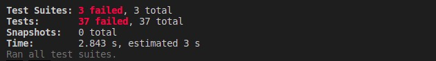

### Dica: desativando testes

Especialmente no início, quando a maioria dos testes está falhando, a saída após executar os testes é bastante poluída. Você pode desabilitar temporariamente um teste utilizando a função `skip` junto à função `it`. Como o nome indica, esta função "pula" um teste:

```js
  it.skip('Será validado que o campo "email" é obrigatório', async () => {
    await frisby
      .post(`${url}/users/`,
        {
          name: 'Erick Jacquin',
          password: '12345678',
        })
      .expect('status', 400)
      .then((response) => {
        const { body } = response;
        const result = JSON.parse(body);
        expect(result.message).toBe('Invalid entries. Try again.');
      });
  })
```

Uma estratégia é pular todos os testes no início e ir implementando um teste de cada vez, removendo dele a função `skip`.

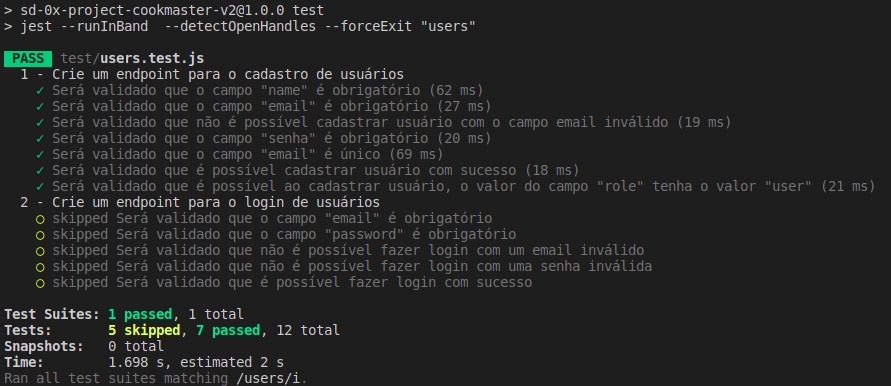

Você também pode rodar apenas um arquivo de teste, por exemplo:

```bash
npm test users.test.js
```

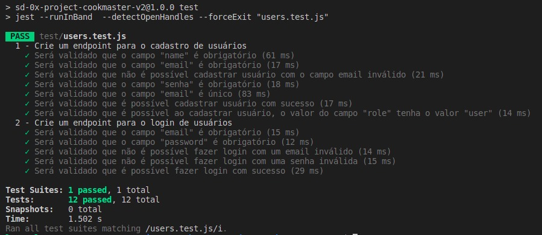

⚠️ Lembre-se de não entregar o projeto com nenhum teste ignorado. **Testes ignorados serão tratados como testes falhando**. ⚠️

⚠️ **Não apague, em hipótese alguma, qualquer teste ou arquivo deste repositório**. ⚠️

---

# Requisitos do projeto

## Requisitos Obrigatórios

### 1 - Crie um endpoint para o cadastro de usuários

- A rota deve ser (`/users`).

- No banco um usuário precisa ter os campos Email, Senha, Nome e Role.

- Para criar um usuário através da API, todos os campos são obrigatórios, com exceção do Role.

- O campo Email deve ser único.

- Usuários criados através desse endpoint devem ter seu campo Role com o atributo _user_, ou seja, devem ser usuários comuns, e não admins.

- O body da requisição deve conter o seguinte formato:

  ```json
  {
    "name": "string",
    "email": "string",
    "password": "string"
  }
  ```
- Não use `bcrypt` ou outra biblioteca para encriptar a senha, para que o avaliador funcione corretamente.

**Além disso, as seguintes verificações serão feitas:**

- **[Será validado que o campo "name" é obrigatório]**

Se o usuário não tiver o campo "name" o resultado retornado deverá ser conforme exibido abaixo, com um status http `400`:

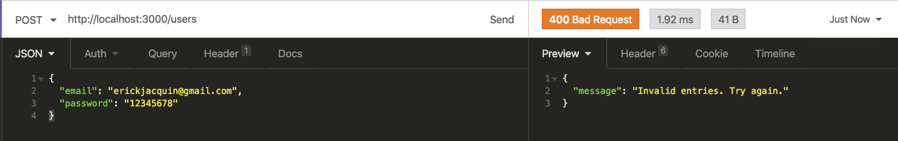

- **[Será validado que o campo "email" é obrigatório]**

Se o usuário não tiver o campo "email" o resultado retornado deverá ser conforme exibido abaixo, com um status http `400`:

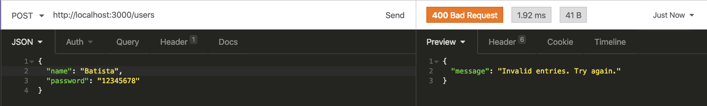

- **[Será validado que não é possível cadastrar usuário com o campo email inválido]**

Se o usuário tiver o campo email inválido o resultado retornado deverá ser conforme exibido abaixo, com um status http `400`:

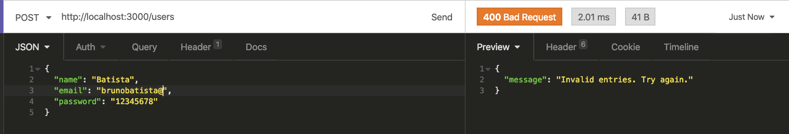

- **[Será validado que o campo "senha" é obrigatório]**

Se o usuário não tiver o campo "senha" o resultado retornado deverá ser conforme exibido abaixo, com um status http `400`:

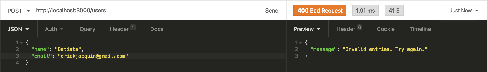

- **[Será validado que o campo "email" é único]**

Se o usuário cadastrar o campo "email" com um email que já existe, o resultado retornado deverá ser conforme exibido abaixo, com um status http `409`:

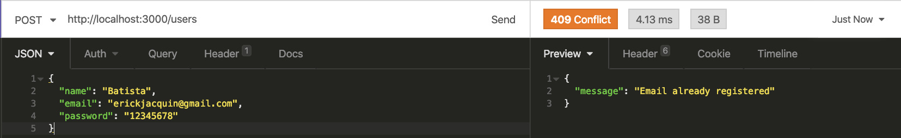

- **[Será validado que é possível cadastrar usuário com sucesso]**

Se o usuário for cadastrado com sucesso o resultado retornado deverá ser conforme exibido abaixo, com um status http `201`:


- **[Será validado que é possível ao cadastrar usuário, o valor do campo "role" tenha o valor "user"]**

Se o usuário for criado com sucesso o resultado retornado deverá ser conforme exibido abaixo, com um status http `201`:

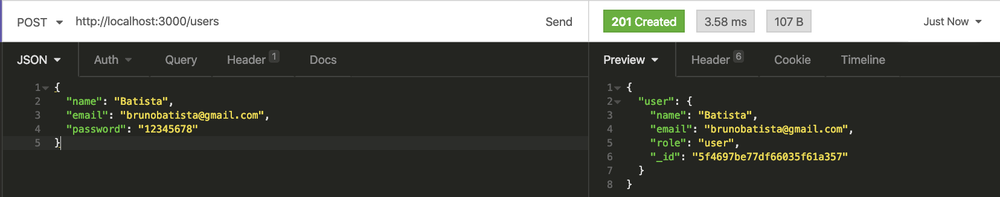

### 2 - Crie um endpoint para o login de usuários

- A rota deve ser (`/login`).

- A rota deve receber os campos Email e Senha e esses campos devem ser validados no banco de dados.

- Na configuração do `JWT` **não use variáveis de ambientes** para não ter conflito com o avaliador.

- Um token `JWT` deve ser gerado e retornado caso haja sucesso no login. No seu payload deve estar presente o id, email e role do usuário.

- O body da requisição deve conter o seguinte formato:

  ```json
  {
    "email": "string",
    "password": "string"
  }
  ```

**Além disso, as seguintes verificações serão feitas:**

- **[Será validado que o campo "email" é obrigatório]**

Se o login não tiver o campo "email" o resultado retornado deverá ser conforme exibido abaixo, com um status http `401`:

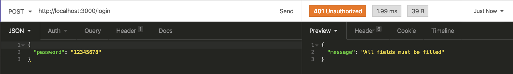

- **[Será validado que o campo "password" é obrigatório]**

Se o login não tiver o campo "password" o resultado retornado deverá ser conforme exibido abaixo, com um status http `401`:

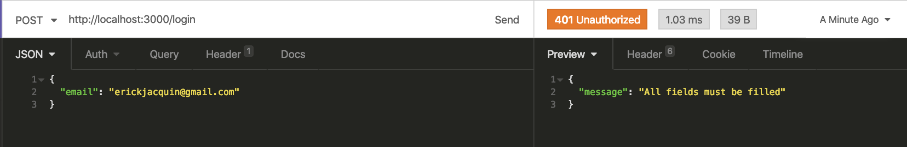

- **[Será validado que não é possível fazer login com um email inválido]**

Se o login tiver o email inválido o resultado retornado deverá ser conforme exibido abaixo, com um status http `401`:

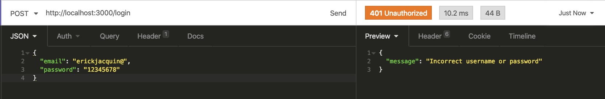

- **[Será validado que não é possível fazer login com uma senha inválida]**

Se o login tiver a senha inválida o resultado retornado deverá ser conforme exibido abaixo, com um status http `401`:

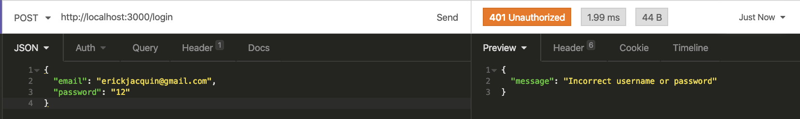

- **[Será validado que é possível fazer login com sucesso]**

Se foi feito login com sucesso o resultado retornado deverá ser conforme exibido abaixo, com um status http `200`:

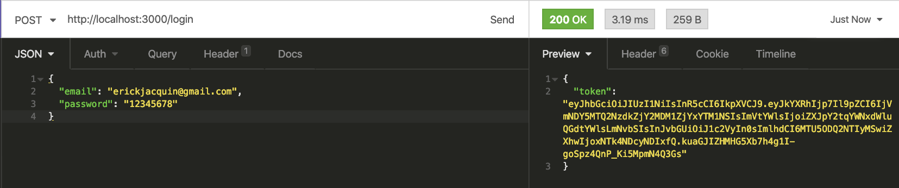

### 3 - Crie um endpoint para o cadastro de receitas

- A rota deve ser (`/recipes`).

- A receita só pode ser criada caso o usuário esteja logado e o token `JWT` validado.

- No banco, a receita deve ter os campos Nome, Ingredientes, Modo de preparo, URL da imagem e Id do Autor.

- Nome, ingredientes e modo de preparo devem ser recebidos no corpo da requisição, com o seguinte formato:

  ```json
  {
    "name": "string",
    "ingredients": "string",
    "preparation": "string"
  }
  ```

- O campo dos ingredientes pode ser um campo de texto aberto.

- O campo ID do autor, deve ser preenchido automaticamente com o ID do usuário logado, que deve ser extraído do token JWT.

- A URL da imagem será preenchida através de outro endpoint

**Além disso, as seguintes verificações serão feitas:**

- **[Será validado que não é possível cadastrar receita sem o campo "name"]**

Se a receita não tiver o campo "name" o resultado retornado deverá ser conforme exibido abaixo, com um status http `400`:

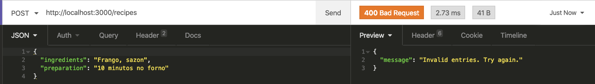

- **[Será validado que não é possível cadastrar receita sem o campo "ingredients"]**

Se a receita não tiver o campo "ingredients" o resultado retornado deverá ser conforme exibido abaixo, com um status http `400`:

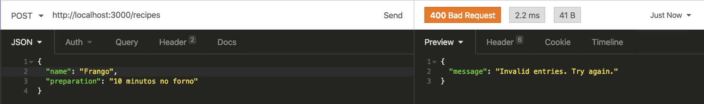

- **[Será validado que não é possível cadastrar receita sem o campo "preparation"]**

Se a receita não tiver o campo "preparation" o resultado retornado deverá ser conforme exibido abaixo, com um status http `400`:

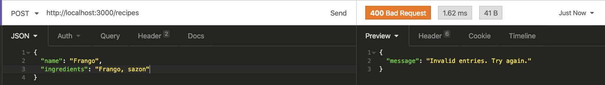

- **[Será validado que não é possível cadastrar uma receita com token invalido]**

Se a receita não tiver o token válido o resultado retornado deverá ser conforme exibido abaixo, com um status http `401`:

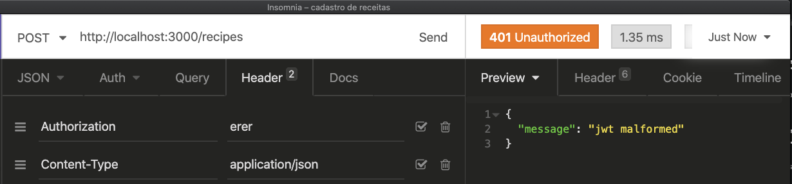

- **[Será validado que é possível cadastrar uma receita com sucesso]**

O resultado retornado para cadastrar a receita com sucesso deverá ser conforme exibido abaixo, com um status http `201`:

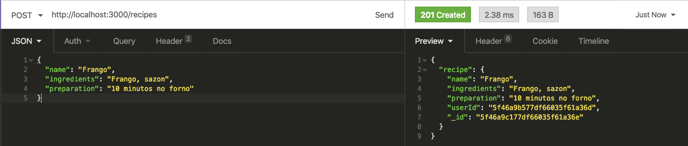

### 4 - Crie um endpoint para a listagem de receitas

- A rota deve ser (`/recipes`).

- A rota pode ser acessada por usuários logados ou não

**Além disso, as seguintes verificações serão feitas:**

- **[Será validado que é possível listar todas as receitas sem estar autenticado]**

O resultado retornado para listar receitas com sucesso deverá ser conforme exibido abaixo, com um status http `200`:

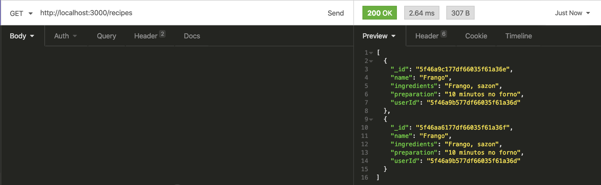

- **[Será validado que é possível listar todas as receitas estando autenticado]**

O resultado retornado para listar receitas com sucesso deverá ser conforme exibido abaixo, com um status http `200`:


### 5 - Crie um endpoint para visualizar uma receita específica

- A rota deve ser (`/recipes/:id`).

- A rota pode ser acessada por usuários logados ou não

**Além disso, as seguintes verificações serão feitas:**

- **[Será validado que é possível listar uma receita específica sem estar autenticado]**

O resultado retornado para listar uma receita com sucesso deverá ser conforme exibido abaixo, com um status http `200`:

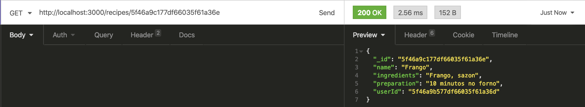

- **[Será validado que é possível listar uma receita específica estando autenticado]**

O resultado retornado para listar uma receita com sucesso deverá ser conforme exibido abaixo, com um status http `200`:


- **[Será validado que não é possível listar uma receita que não existe]**

O resultado retornado para listar uma receita que não existe deverá ser conforme exibido abaixo, com um status http `404`:

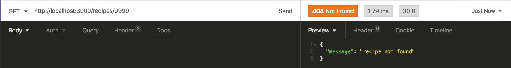

### 6 - Crie uma query em mongo que insira uma pessoa usuária com permissões de admin

Crie um arquivo `seed.js` na raiz do projeto com uma query do Mongo DB capaz de inserir um usuário na coleção _users_ com os seguintes valores:

`{ name: 'admin', email: 'root@email.com', password: 'admin', role: 'admin' }`

**Obs.:** Esse usuário tem o poder de criar, deletar, atualizar ou remover qualquer receita, independente de quem a cadastrou. Isso será solicitado ao longo dos próximos requisitos.

**Além disso, as seguintes verificações serão feitas:**

- **[Será validado que o projeto tem um arquivo de seed, com um comando para inserir um usuário root e verifico que é possível fazer login]**    

Será validado no arquivo `seed.js` existe a query para criar um usuário root

### 7 - Crie um endpoint para a edição de uma receita

- A rota deve ser (`/recipes/:id`).

- A receita só pode ser atualizada caso o usuário esteja logado e o token `JWT` validado.

- A receita só pode ser atualizada caso pertença ao usuário logado, ou caso esse usuário seja um admin.

- O corpo da requisição deve receber o seguinte formato:

  ```json
  {
    "name": "string",
    "ingredients": "string",
    "preparation": "string"
  }
  ```

**Além disso, as seguintes verificações serão feitas:**

- **[Será validado que não é possível editar receita sem estar autenticado]**

O resultado retornado para editar receita sem autenticação deverá ser conforme exibido abaixo, com um status http `401`:

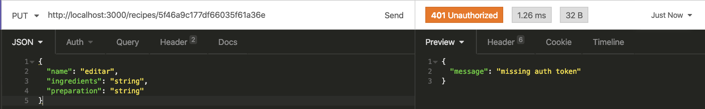

- **[Será validado que não é possível editar receita com token inválido]**

O resultado retornado para editar receita com token inválido deverá ser conforme exibido abaixo, com um status http `401`:

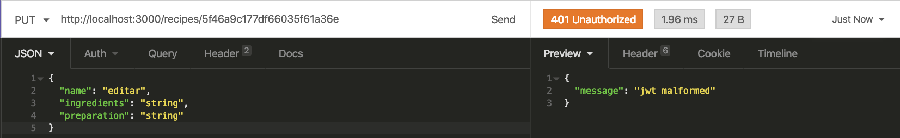

- **[Será validado que é possível editar receita estando autenticado]**

O resultado retornado para editar uma receita com sucesso deverá ser conforme exibido abaixo, com um status http `200`:

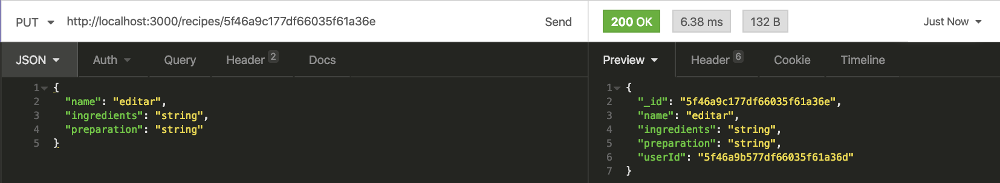

- **[Será validado que é possível editar receita com usuário admin]**

O resultado retornado para editar uma receita com sucesso deverá ser conforme exibido abaixo, com um status http `200`:


### 8 - Crie um endpoint para a exclusão de uma receita

- A rota deve ser (`/recipes/:id`).

- A receita só pode ser excluída caso o usuário esteja logado e o token `JWT` validado.

- A receita só pode ser excluída caso pertença ao usuário logado, ou caso o usuário logado seja um admin.

**Além disso, as seguintes verificações serão feitas:**

- **[Será validado que não é possível excluir receita sem estar autenticado]**

O resultado retornado para excluir uma receita sem autenticação deverá ser conforme exibido abaixo, com um status http `401`:

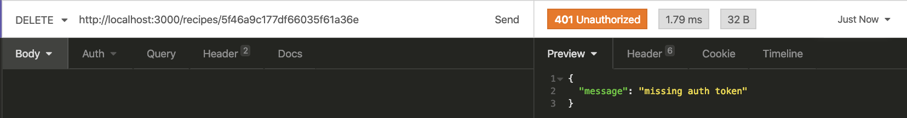

- **[Será validado que é possível excluir receita estando autenticado]**

O resultado retornado para excluir uma receita com sucesso deverá ser conforme exibido abaixo, com um status http `204`:

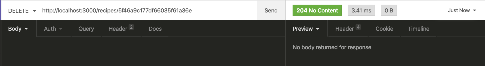

- **[Será validado que é possível excluir receita com usuário admin]**

O resultado retornado para excluir uma receita com sucesso deverá ser conforme exibido abaixo, com um status http `204`:


### 9 - Crie um endpoint para a adição de uma imagem a uma receita

- A rota deve ser (`/recipes/:id/image/`).

- A imagem deve ser lida do campo `image`.

- O endpoint deve aceitar requisições no formato `multipart/form-data`.

- A receita só pode ser atualizada caso o usuário esteja logado e o token `JWT` validado.

- A receita só pode ser atualizada caso pertença ao usuário logado ou caso o usuário logado seja admin.

- O upload da imagem deverá ser feito utilizando o `Multer`.

- O nome do arquivo deve ser o ID da receita, e sua extensão `.jpeg`.

- A URL completa para acessar a imagem através da API deve ser gravada no banco de dados, junto com os dados da receita.

**Além disso, as seguintes verificações serão feitas:**

- **[Será validado que é possível enviar foto com usuário autenticado]**

O resultado retornado para adicionar uma foto na receita com sucesso deverá ser conforme exibido abaixo, com um status http `200`:

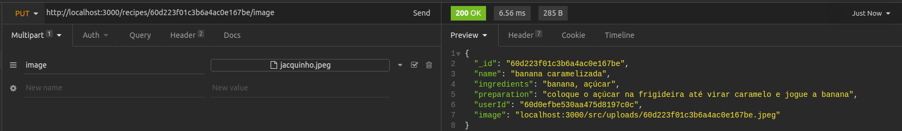

- **[Será validado que ao enviar foto, o nome da imagem é alterada para o id da receita]**

O resultado retornado para adicionar uma foto na receita com sucesso deverá ser conforme exibido abaixo, com um status http `200`:


- **[Será validado que não é possível enviar foto sem estar autenticado]**

O resultado retornado para adicionar uma foto na receita com sucesso deverá ser conforme exibido abaixo, com um status http `401`:

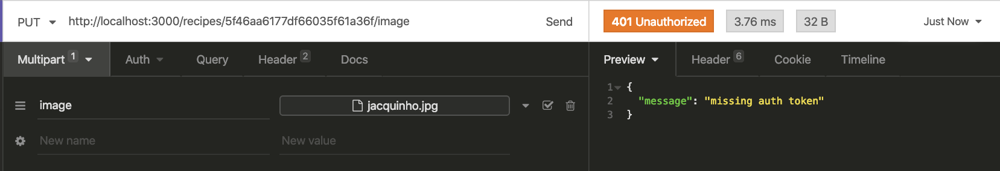

- **[Será validado que é possível enviar foto com usuário admin]**

O resultado retornado para adicionar uma foto na receita com sucesso deverá ser conforme exibido abaixo, com um status http `200`:


### 10 - Crie um endpoint para acessar a imagem de uma receita

- As imagens devem estar disponíveis através da rota `/images/<id-da-receita>.jpeg` na API.

**Além disso, as seguintes verificações serão feitas:**

- **[Será validado que é retornada uma imagem como resposta]**

O resultado retornado deverá ser do tipo imagem, com um status http `200`:

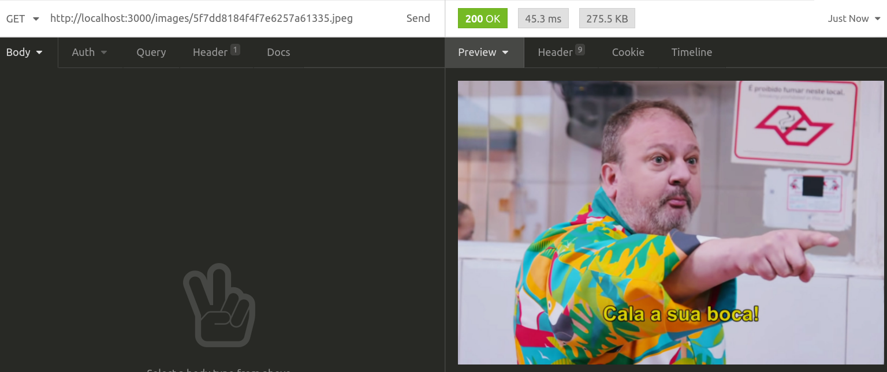

### 11 - Crie testes de integração que cubram no mínimo 30% dos arquivos em `src`, com um mínimo de 50 linhas cobertas

- Os testes de integração devem ser criados na pasta `./src/integration-tests`, essa pasta **não pode ser renomeada ou removida**;

- O arquivo `change.me.test.js` pode ser alterado, renomeado ou removido;

- Os testes devem ser criados usando o instrumental e boas práticas apresentado nos conteúdos de testes do course;

- Para rodar os testes, utilize o comando `npm run dev:test`;

- Para visualizar a cobertura, utilize o comando `npm run dev:test:coverage`;

**Além disso, as seguintes verificações serão feitas:**

- **[Será validado que o teste cobre o valor esperado]**

Nenhum teste pode ser pulado;
O resultado do percentual total de cobertura deve ser igual ou maior que `30`;
O resultado do numero total de linhas cobertas deve ser igual ou maior que `50`.

## Requisitos Bônus

### 12 - Crie um endpoint para cadastro de pessoas administradoras

- A rota deve ser (`/users/admin`).

- Só será possível adicionar um admin caso esta ação esteja sendo feita por outro admin, portanto, deve ser validado se há um admin logado.

- Por padrão, as requisições pra esse endpoint devem adicionar um usuário com a role _admin_.

- O corpo da requisição deve ter o seguinte formato:

  ```json
  {
    "name": "string",
    "email": "string",
    "password": "string"
  }
  ```

**Além disso, as seguintes verificações serão feitas:**

- **[Será validado que não é possível cadastrar um usuário admin, sem estar autenticado como um usuário admin]**

Se o usuário admin não é criado com sucesso o resultado retornado deverá ser conforme exibido abaixo, com um status http `403`:


- **[Será validado que é possível cadastrar um usuário admin]**

Se o usuário admin é criado com sucesso o resultado retornado deverá ser conforme exibido abaixo, com um status http `201`:

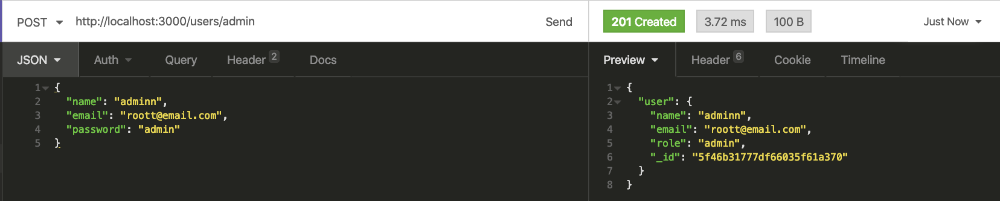

### 13 - Crie testes de integração que cubram no mínimo 60% dos arquivos em `src`, com um mínimo de 100 linhas cobertas

- Os testes de integração devem ser criados na pasta `./src/integration-tests`, essa pasta **não pode ser renomeada ou removida**;

- O arquivo `change.me.test.js` pode ser alterado, renomeado ou removido;

- Os testes devem ser criados usando o instrumental e boas práticas apresentado nos conteúdos de testes do course;

- Para rodar os testes, utilize o comando `npm run dev:test`;

- Para visualizar a cobertura, utilize o comando `npm run dev:test:coverage`;

**Além disso, as seguintes verificações serão feitas:**

- **[Será validado que o teste cobre o valor esperado]**

Nenhum teste pode ser pulado;
O resultado do percentual total de cobertura deve ser igual ou maior que `60`;
O resultado do numero total de linhas cobertas deve ser igual ou maior que `100`.

### 14 - Crie testes de integração que cubram no mínimo 90% dos arquivos em `src`, com um mínimo de 150 linhas cobertas

- Os testes de integração devem ser criados na pasta `./src/integration-tests`, essa pasta **não pode ser renomeada ou removida**;

- O arquivo `change.me.test.js` pode ser alterado, renomeado ou removido;

- Os testes devem ser criados usando o instrumental e boas práticas apresentado nos conteúdos de testes do course;

- Para rodar os testes, utilize o comando `npm run dev:test`;

- Para visualizar a cobertura, utilize o comando `npm run dev:test:coverage`;

**Além disso, as seguintes verificações serão feitas:**

- **[Será validado que o teste cobre o valor esperado]**

Nenhum teste pode ser pulado;
O resultado do percentual total de cobertura deve ser igual ou maior que `90`;
O resultado do numero total de linhas cobertas deve ser igual ou maior que `150`.

---

## Depois de terminar o desenvolvimento (opcional)

Para sinalizar que o seu projeto está pronto para o _"Code Review"_ dos seus colegas, faça o seguinte:

* Vá até a página **DO SEU** _Pull Request_, adicione a label de _"code-review"_ e marque seus colegas:

  * No menu à direita, clique no _link_ **"Labels"** e escolha a _label_ **code-review**;

  * No menu à direita, clique no _link_ **"Assignees"** e escolha **o seu usuário**;

  * No menu à direita, clique no _link_ **"Reviewers"** e digite `students`, selecione o time `tryber/students-sd-00`.

Caso tenha alguma dúvida, [aqui tem um video explicativo](https://vimeo.com/362189205).

---

# Revisando um pull request

Use o conteúdo sobre [Code Review](https://course.betrybe.com/real-life-engineer/code-review/) para te ajudar a revisar os _Pull Requests_.

#VQV

---

# Avisos finais

Ao finalizar e submeter o projeto, não se esqueça de avaliar sua experiência preenchendo o formulário. Leva menos de 3 minutos!

Link: [FORMULÁRIO DE AVALIAÇÃO DE PROJETO](https://be-trybe.typeform.com/to/ZTeR4IbH#cohort_name=Turma%2011)

O avaliador automático não necessariamente avalia seu projeto na ordem em que os requisitos aparecem no readme. Isso acontece para deixar o processo de avaliação mais rápido. Então, não se assuste se isso acontecer, ok?
